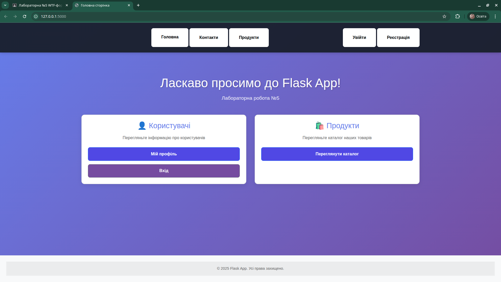
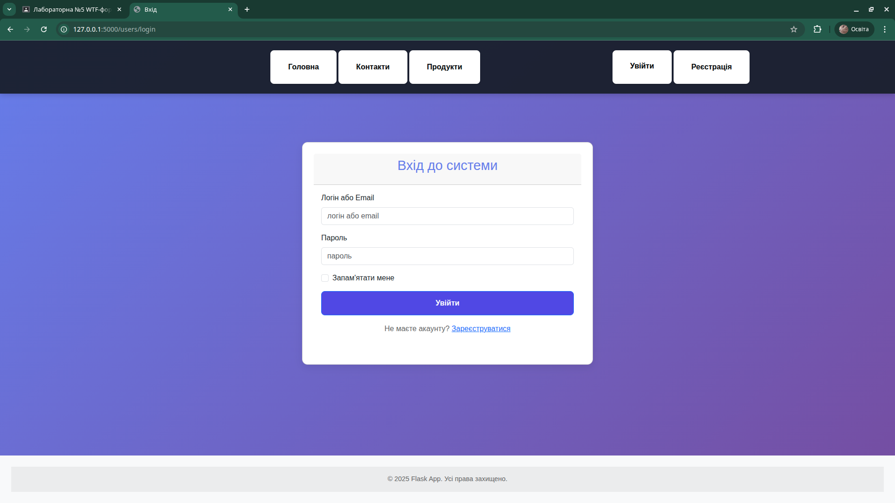
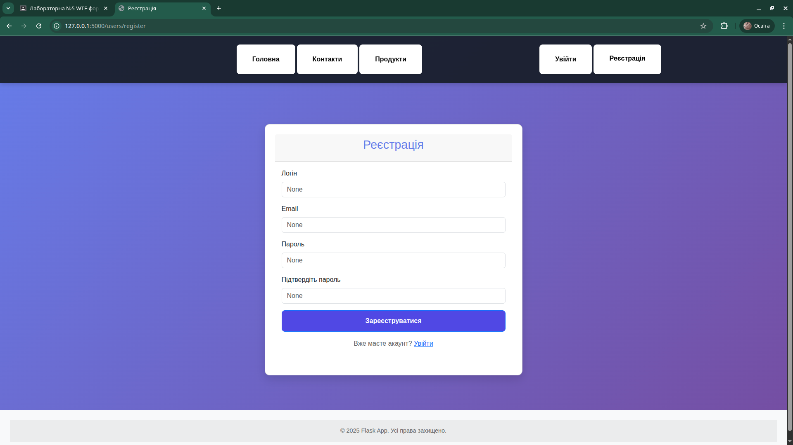
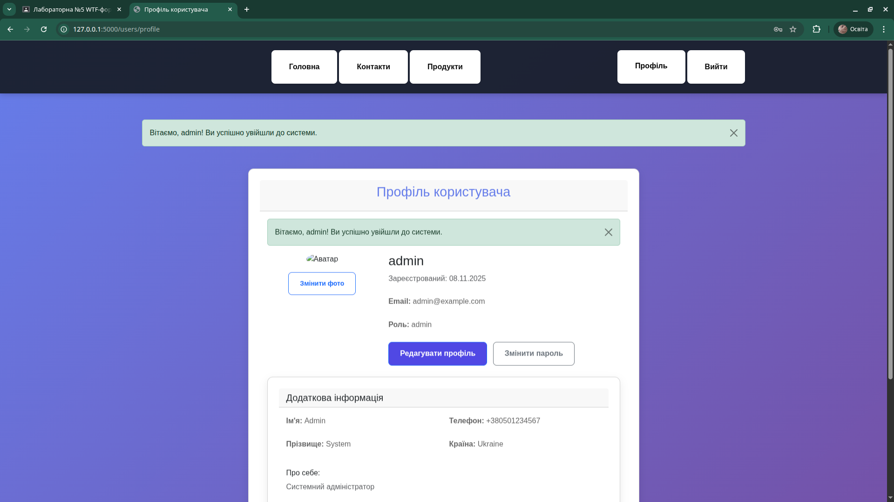
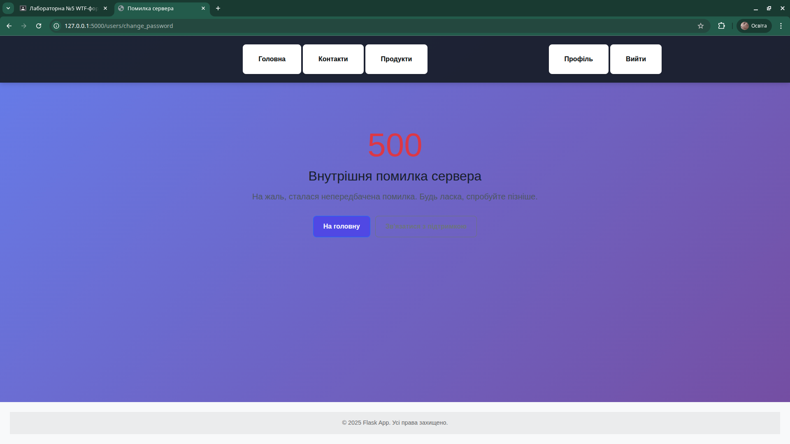
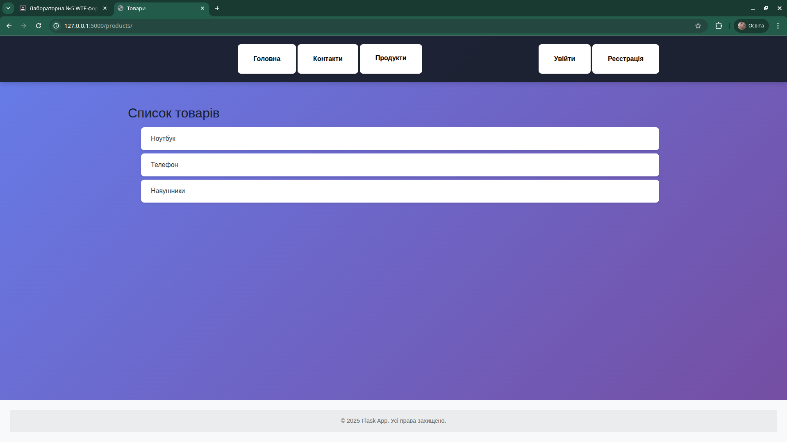
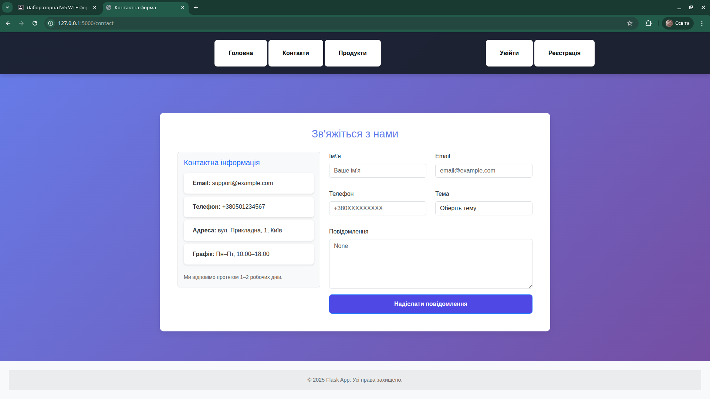

# Лабораторна робота №5: WTF-форми у Flask

## 📋 Зміст
- [Мета роботи](#-мета-роботи)
- [Функціонал](#-функціонал)
- [Встановлення та запуск](#-встановлення-та-запуск)
- [Тестові облікові записи](#-тестові-облікові-записи)

## 🎯 Мета роботи
- Побудова форм за допомогою Flask-WTF
- Використання макросів для розмітки полів форми
- Виведення flash-повідомлень про успішні/неуспішні дії
- Дотримання патерну "Post/Redirect/Get"


## 🎨 Функціонал

### Контактна форма
- Валідація всіх обов'язкових полів
- Перевірка формату email
- Валідація номера телефону за українським форматом
- Вибір теми зі списку
- Логування відправлених даних
- Flash-повідомлення про успішну/невдалу відправку

### Форма входу
- Авторизація за логіном або email
- Захист від CSRF
- Опція "Запам'ятати мене"
- Перенаправлення на захищені сторінки
- Виведення помилок валідації

## 🚀 Встановлення та запуск

1. Клонуйте репозиторій:
```bash
git clone <repo-url>
cd flask_app_chupyrchuk

## 🚀 Запуск додатку

1. Активуйте віртуальне середовище:
```bash
source venv/bin/activate
```

2. Запустіть Flask сервер:
```bash
python run.py
```

3. Відкрийте браузер:
```
http://localhost:5000
```

4. Перейдіть на сторінку входу:
```
http://localhost:5000/users/login
```

## 🔐 Тестові облікові записи

| Username | Password |
|----------|----------|
| admin | admin123 |
| user | password |
| roman | roman123 |

## Скріншоти
<<<<<<< HEAD


=======















>>>>>>> 8714878 (lab5 commit delete update)

**Автор**: Roman Chupyrchuk  
**Дата**: 8.11.2025  
**Гілка**: lab5
