# Лабораторна робота №6: ORM, SQLAlchemy та CRUD у Flask

## 📋 Зміст
- [Мета роботи](#-мета-роботи)
- [Функціонал](#-функціонал)
- [Встановлення та запуск](#-встановлення-та-запуск)
- [Тестові облікові записи](#-тестові-облікові-записи)

## 🎯 Мета роботи
- Налаштувати Flask-проєкт з application factory і конфігураціями (dev, testing, prod)
- Інтегрувати ORM SQLAlchemy 2.0 і Flask-Migrate (Alembic)
- Реалізувати CRUD для постів (створення, список, деталі, редагування, видалення)
- Використати Flask-WTF, Jinja2, Bootstrap 5 та кастомний CSS
- Додати модульні тести для CRUD-операцій


## 🎨 Функціонал (Posts)
- Блюпринт `post` з маршрутами:
  - `GET /post` — список активних постів за датою (спадання)
  - `GET|POST /post/create` — створення поста (автор — користувач із сесії або Anonymous)
  - `GET /post/<id>` — перегляд поста
  - `GET|POST /post/<id>/update` — редагування поста
  - `GET|POST /post/<id>/delete` — підтвердження і видалення
- Flash-повідомлення після CRUD-дій
- Шаблони: `all_posts.html`, `detail_post.html`, `add_post.html`, `delete_confirm.html`
- Стилізація: Bootstrap 5 + `posts.css`, зображення `default.jpg`

## 🚀 Встановлення та запуск

1. Клонуйте репозиторій:
```bash
git clone <https://github.com/RomaKiberline/flask-app-lab.git>
cd flask_app_chupyrchuk
```

2. Створіть та активуйте віртуальне середовище, встановіть залежності:
```bash
python3 -m venv venv
./venv/bin/pip install -r requirements.txt
```

3. Налаштуйте змінні середовища у `.env` (приклад):
```env
FLASK_APP=run.py
FLASK_ENV=development
SECRET_KEY=change-me-in-prod
DATABASE_URL=sqlite:///instance/data.sqlite
```

4. Міграції БД (Flask-Migrate):
```bash
./venv/bin/flask db init
./venv/bin/flask db migrate -m "Initial migration"
./venv/bin/flask db upgrade
```

5. Запуск застосунку:
```bash
./venv/bin/python run.py
```

6. Відкрити в браузері:
```
http://localhost:5000
```

7. Запуск тестів:
```bash
./venv/bin/python -m unittest -v tests.test_posts
```

## 🔐 Тестові облікові записи

| Username | Password |
|----------|----------|
| admin | admin123 |
| user | password |
| roman | roman123 |

## 📸 Скріншоти

### Частина 2 - Flask Shell команди
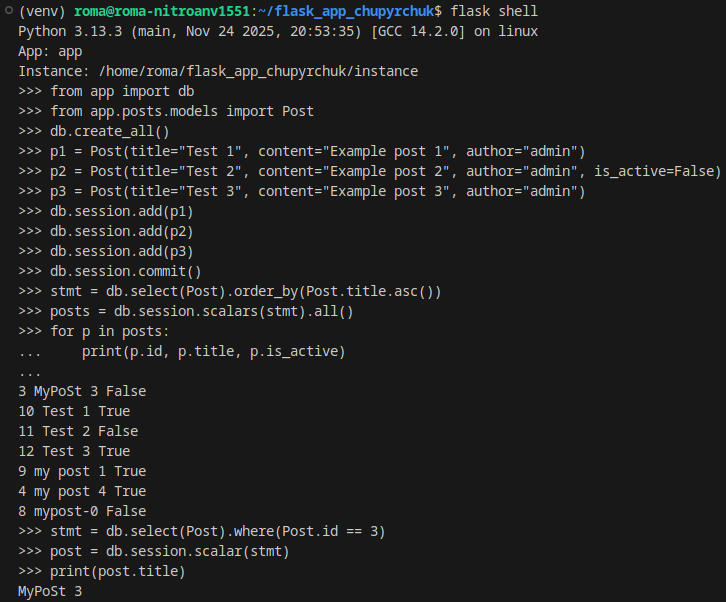
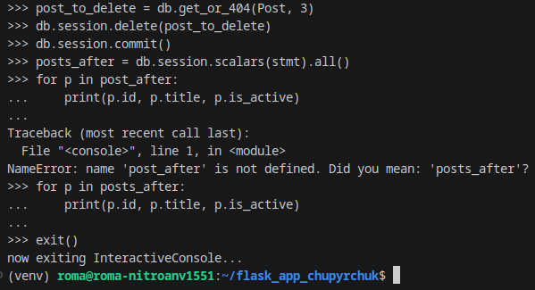
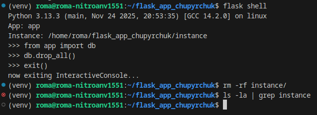


### Частина 3 - Міграції
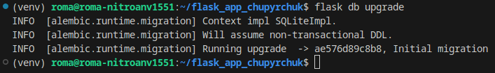

### Частина 6 - Ручне тестування

#### Список постів з фільтрами
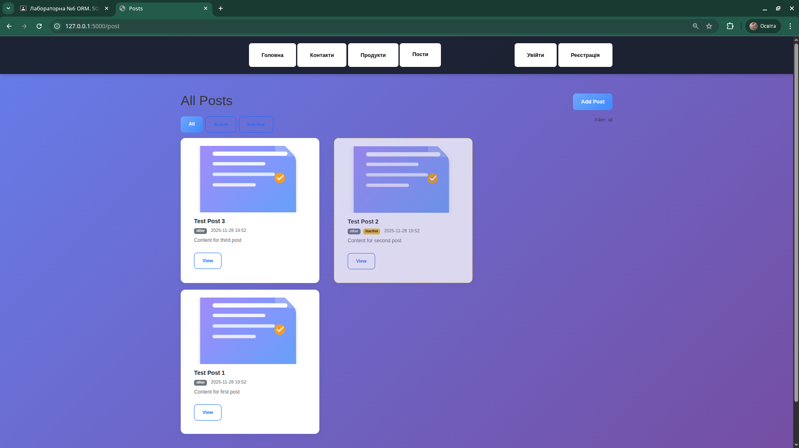
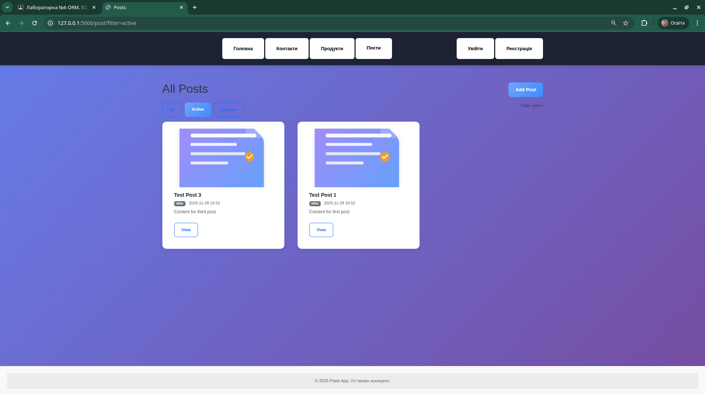
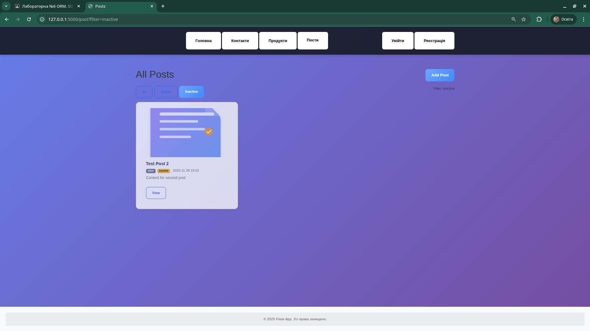

#### Перегляд поста
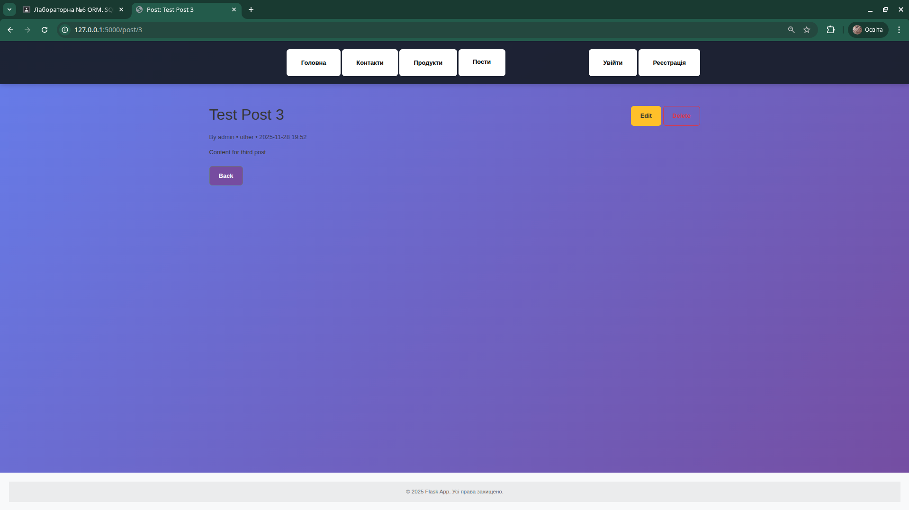

#### Додавання нового поста
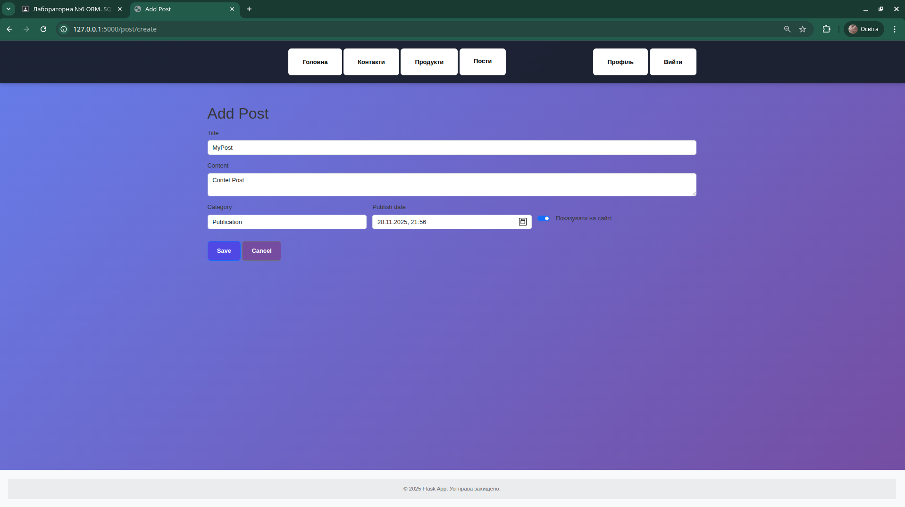
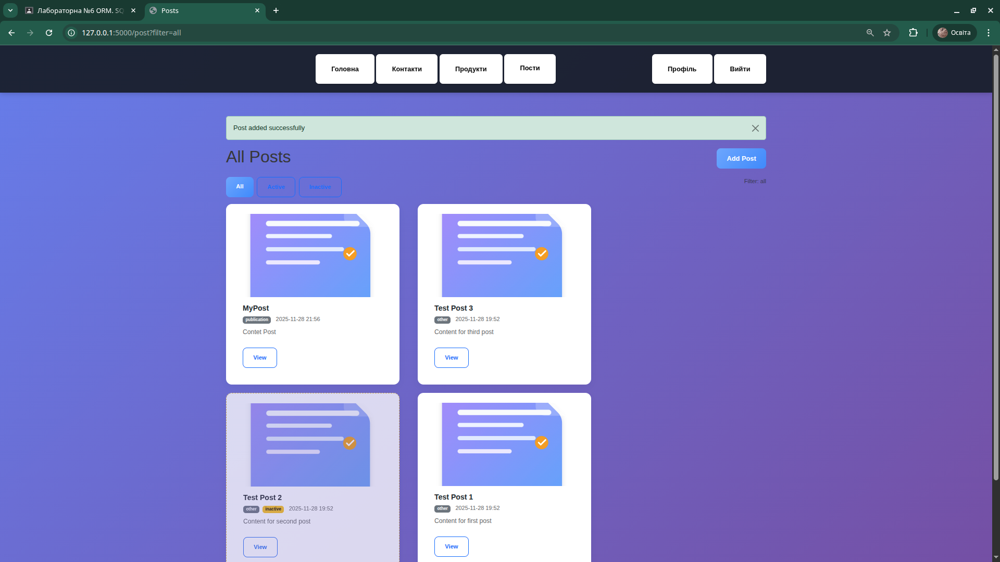

#### Редагування поста

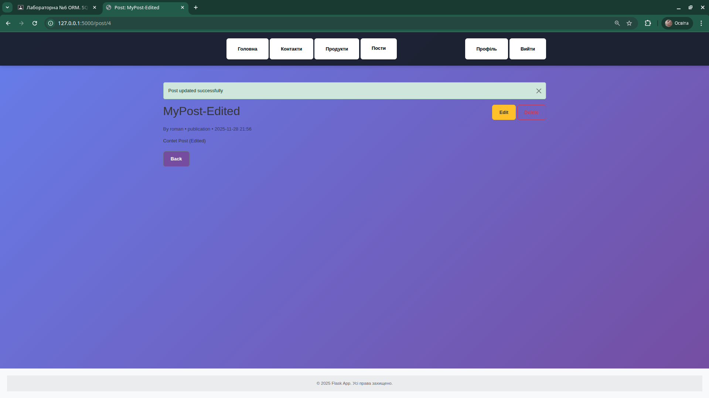

#### Видалення поста
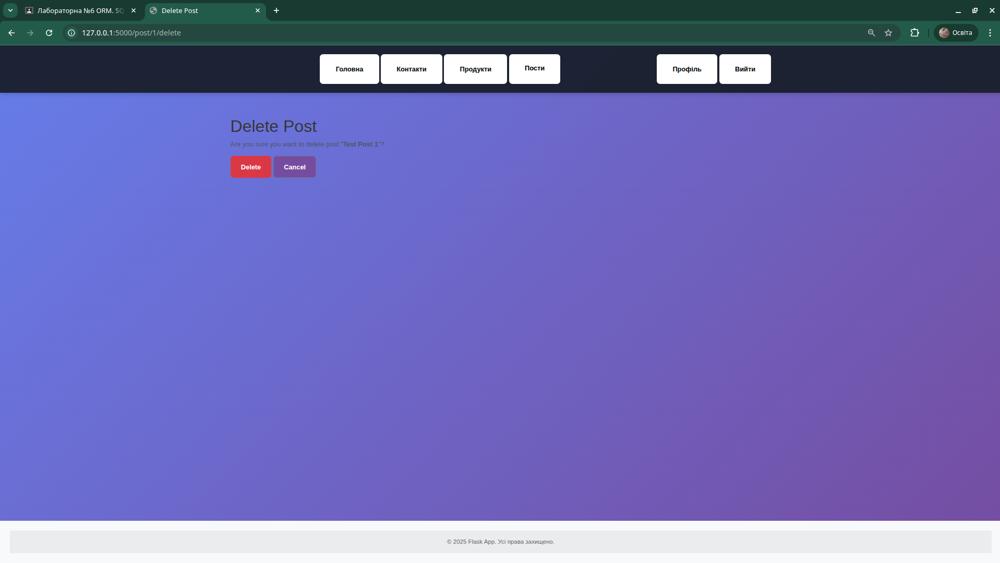
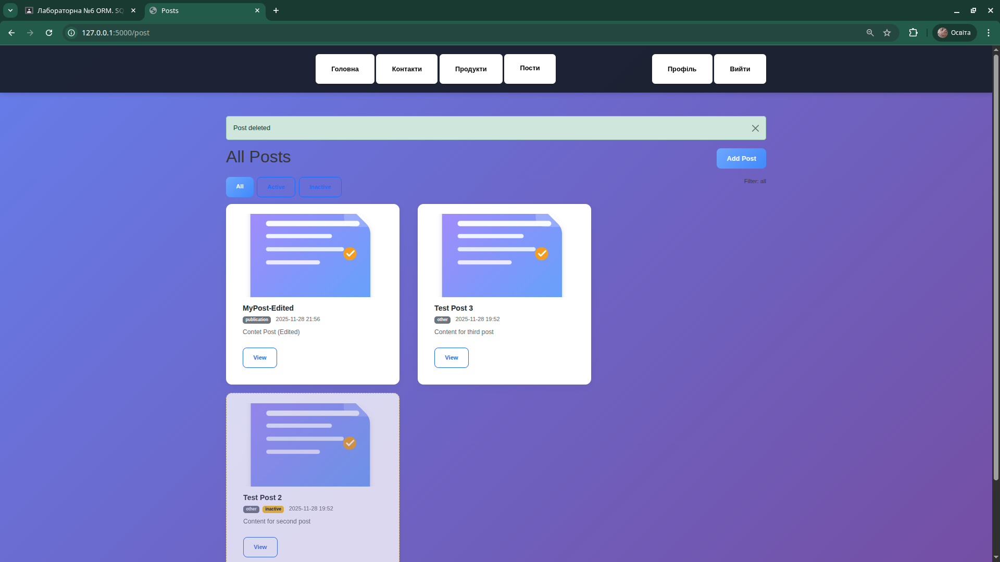

### Модульні тести
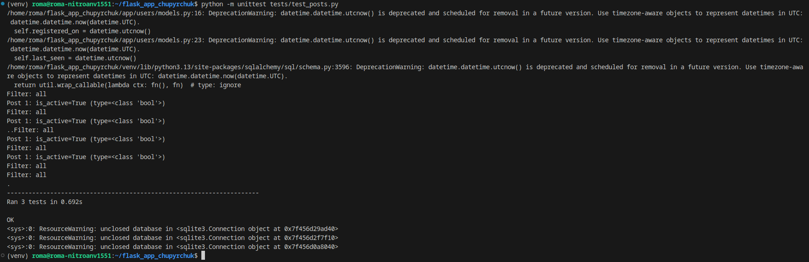

**Автор**: Roman Chupyrchuk  
**Дата**: 28.11.2025  
**Гілка**: lab6
